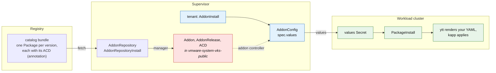

# dayzero-addon-service

[](https://github.com/warroyo/dayzero-addon-service/actions/workflows/test.yml)
[](https://github.com/warroyo/dayzero-addon-service/actions/workflows/build-release.yml)
[](https://github.com/warroyo/dayzero-addon-service/releases/latest)

A VKS addon that applies operator-supplied Kubernetes YAML into a workload cluster at
provisioning time: namespaces, service accounts, RBAC, resource quotas, and other
day-zero configuration. Tenants attach it per cluster and pass the YAML in as data, so
there is no workload-cluster kubeconfig to hand out and nothing to rebuild per payload.

## How it works

The addon ships as a Carvel package repository: a catalog carrying every released version
of the package at once. An administrator points an `AddonRepository` at it, and the VKS
addon manager creates the `Addon`, an `AddonRelease` per package version, and the
`AddonConfigDefinition`s in `vmware-system-vks-public`. Tenants then attach the addon with
an `AddonInstall` and supply YAML through an `AddonConfig` per cluster.



Whatever a tenant writes in `AddonConfig.spec.values` is rendered into a values Secret.
The guest package reads that Secret, ytt turns the values back into the original
resources, and kapp applies them. To change the payload you edit the `AddonConfig`; there
is no rebuild, version bump or re-upload.

## Install

There are two ways to install, and they end up in the same place: the same two CRs
pointing at the same published catalog. Pick whichever matches how your Supervisor is
administered. Each
[release](https://github.com/warroyo/dayzero-addon-service/releases/latest) ships the
artifact for both.

**You install once.** The registration follows a rolling `:stable` tag, so later releases
arrive on their own — no new resources, no re-apply, no upgrade. The install artifacts do
not change between releases.

### Method 1: the Supervisor Service

For environments where services are installed through the vCenter catalog. Download
`dayzero-addon.yml` from the [latest
release](https://github.com/warroyo/dayzero-addon-service/releases/latest):

```sh
gh release download --repo warroyo/dayzero-addon-service --pattern dayzero-addon.yml
```

Then upload it through **Workload Management → Services → Add Service** and create a
service instance. The deploy places the two CRs in the service's own namespace, where the
manager reconciles them. There is nothing to edit: the catalog image is already the
package's values default.

You do not need to upgrade the service instance to pick up a new package version — the
catalog reaches it through the tag. Upgrading is safe when you want a newer wrapper: the
CRs are identical across versions, so kapp re-applies them as a no-op.

### Method 2: apply the AddonRepository directly

For admins with Supervisor `kubectl` access. Download `dayzero-addonrepository.yml` from
the same release and apply it:

```sh
gh release download --repo warroyo/dayzero-addon-service --pattern dayzero-addonrepository.yml
kubectl apply -f dayzero-addonrepository.yml
```

Re-applying the same file later is harmless. Editing a registration that is already in
use is not possible — if you need different settings, see
[`CONTRIBUTING.md`](CONTRIBUTING.md) for rendering your own manifest.

### Confirm it registered

```sh
kubectl -n vmware-system-vks-public get addon,addonrelease,acd | grep dayzero
```

You should see one `AddonRelease` and one `AddonConfigDefinition` per package version in
the catalog. Pin a cluster to one with `releaseFilter` on the `AddonInstall`.

### Keeping up with releases

Nothing to do. New package versions arrive on their own, roughly ten minutes after a
release, and show up as additional `AddonRelease`s. Clusters stay on whatever version
their `releaseFilter` names until you move it.

Choosing a version is therefore always a pin, never a re-install: every version the
catalog has carried is registered and stays available to roll back to, and moving between
them needs no Supervisor access.

## Usage

Each cluster needs two objects, both in the cluster's own Supervisor namespace.

First, attach the addon (once per namespace). See
[`examples/addoninstall.yml`](examples/addoninstall.yml). Then label the clusters to seed:

```sh
kubectl label cluster my-cluster addons.kubernetes.vmware.com/dayzero=enabled
```

Second, supply the payload: an `AddonConfig` named `<cluster-name>-dayzero`, carrying
the annotation `clusteraddon.addons.kubernetes.vmware.com/owned-for-deletion: "true"`.
Both the name and the annotation matter. The name is how the addon system pairs a config
with a cluster, and without the annotation the `AddonConfig` sticks around after the
`ClusterAddon` is gone.

There are two ways to supply the payload, and you can use both at once:

| Source | Field | Use when |
|---|---|---|
| Structured | `values.resources` | You are writing the payload alongside the AddonConfig and want clean diffs ([example](examples/addonconfig-structured.yml)) |
| Raw string | `values.resourcesYaml` | You are pasting in manifests you already have ([example](examples/addonconfig-inline.yml)) |

A `<cluster-name>-dayzero` ConfigMap in the same namespace gets merged in too, which helps
when a separate pipeline manages the payload
([example](examples/addonconfig-configmap.yml)).

### Cluster identity tokens

Some resources need a value only the running cluster can supply. A payload may use two
literal tokens, expanded per cluster as it is delivered:

| Token | Expands to |
|---|---|
| `${CLUSTER_NAME}` | the cluster's name |
| `${CLUSTER_UID}` | the cluster's `metadata.uid`, assigned by Kubernetes at creation |

The motivating case is a Pinniped `JWTAuthenticator`, whose audience has to carry a UID
that cannot exist when the manifest is written
([example](examples/addonconfig-jwtauthenticator.yml)):

```yaml
spec:
  audience: ${CLUSTER_NAME}-${CLUSTER_UID}
```

Worth knowing:

- **Opt in by using them.** A payload with no tokens is delivered untouched, exactly as it
  was before this existed. There is no flag to set.
- **All three payload sources expand**, the ConfigMap included. Anything a tenant can put
  in the payload is subject to expansion.
- **Spelling is exact.** `${CLUSTER_UID}` expands; `$CLUSTER_UID` and `${CLUSTERUID}` are
  delivered as written. There is no near-miss detection, deliberately — see
  [`docs/design.md`](docs/design.md).
- **No escape hatch.** A payload that wants a literal `${CLUSTER_NAME}` in the delivered
  output cannot have one.
- **Requires 1.0.3 or later.** On an earlier version the tokens are inert text.

### Security posture

The payload is applied by the addon system's own privileged identity, so treat write
access to a cluster's Supervisor namespace as equivalent to workload-cluster admin: a
tenant who can write the `AddonConfig` can apply arbitrary resources to their cluster.
That is the same authority a workload-cluster kubeconfig would grant, so it is not a new
hole, but it does mean you should not give write access to that namespace to anyone you
would not trust with the cluster itself.

An `AddonConfig` is readable by anyone with access to the Supervisor namespace. Do not
inline credentials into one.

## Scope boundary

This seeds configuration; it is not an installer. Use it for `Namespace`s,
`ServiceAccount`s, RBAC, quotas, `Secret`s and CRs. Anything that runs container images
should be its own addon or Helm chart.

## Contributing

Build, test and release mechanics are in [`CONTRIBUTING.md`](CONTRIBUTING.md).

## Docs

| | |
|---|---|
| [`CONTRIBUTING.md`](CONTRIBUTING.md) | Repo layout, build mechanics, releasing |
| [`docs/design.md`](docs/design.md) | Why this addon is built the way it is, and what was rejected |
| [`docs/verify.md`](docs/verify.md) | End-to-end verification runbook |
| [`examples/`](examples/) | Tenant `AddonInstall` and `AddonConfig`, one per payload source, plus cluster identity tokens |
