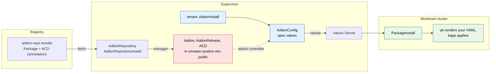

# dayzero-addon-service

[](https://github.com/warroyo/dayzero-addon-service/actions/workflows/test.yml)
[](https://github.com/warroyo/dayzero-addon-service/actions/workflows/build-release.yml)
[](https://github.com/warroyo/dayzero-addon-service/releases/latest)

A VKS addon whose only job is to apply operator-supplied Kubernetes YAML into a workload
cluster at provisioning time: namespaces, service accounts, RBAC, resource quotas and
other day-zero configuration. Tenants attach it per cluster and supply the payload as
data, with no workload-cluster kubeconfig and no artifact authored per payload.

## How it works

The addon ships as a Carvel package repository. An administrator points an
`AddonRepository` at it, and the VKS addon manager materialises the `Addon`,
`AddonRelease` and `AddonConfigDefinition` in `vmware-system-vks-public`. Tenants then
attach the addon with an `AddonInstall` and supply YAML through an `AddonConfig` per
cluster.



The payload flows as data: what a tenant writes in `AddonConfig.spec.values` is rendered
into a values Secret, which feeds the guest package, whose ytt turns it back into the
resources and applies them. Changing the payload is an edit to the `AddonConfig`, with no
rebuild, version bump or re-upload.


## Install

Two methods. Both install the same two CRs pointing at the same published bundle; pick the
one that fits how the Supervisor is administered. Each
[release](https://github.com/warroyo/dayzero-addon-service/releases/latest) ships the
artifact for both, already stamped with that release's bundle version.

### Method 1: the Supervisor Service

For environments where services are installed through the vCenter catalog. Download
`dayzero-addon.yml` from the [latest
release](https://github.com/warroyo/dayzero-addon-service/releases/latest):

```sh
gh release download --repo warroyo/dayzero-addon-service --pattern dayzero-addon.yml
```

Then upload it through **Workload Management → Services → Add Service** and create a
service instance. The deploy places the two CRs in the service's own namespace, where the
manager reconciles them. Nothing to edit: the bundle image and versions are already set as
the package's values defaults, overridable from the service config form.

### Method 2: apply the AddonRepository directly

For admins with Supervisor `kubectl` access. Download `dayzero-addonrepository.yml` from
the same release and apply it:

```sh
gh release download --repo warroyo/dayzero-addon-service --pattern dayzero-addonrepository.yml
kubectl apply -f dayzero-addonrepository.yml
```

[`install/addonrepository.yml`](install/addonrepository.yml) is the same file in-tree, for
pointing `imageURL` at a bundle you published yourself.

### Confirm it registered

```sh
kubectl -n vmware-system-vks-public get addon,addonrelease,acd | grep dayzero
```

## Usage

Two objects per cluster, both in the cluster's own Supervisor namespace.

First, attach the addon, once per namespace. See
[`examples/addoninstall.yml`](examples/addoninstall.yml). Then label the clusters to seed:

```sh
kubectl label cluster my-cluster addons.kubernetes.vmware.com/dayzero=enabled
```

Second, supply the payload: an `AddonConfig` named `<cluster-name>-dayzero`, carrying
the annotation `clusteraddon.addons.kubernetes.vmware.com/owned-for-deletion: "true"`.
Both the name and the annotation are load-bearing. The name is how the addon system pairs
config to cluster, and without the annotation the `AddonConfig` outlives the
`ClusterAddon`.

Two payload sources, which compose:

| Source | Field | Use when |
|---|---|---|
| Structured | `values.resources` | Payload is authored with the AddonConfig. Diffable. ([example](examples/addonconfig-structured.yml)) |
| Raw string | `values.resourcesYaml` | Pasting manifests you already have. ([example](examples/addonconfig-inline.yml)) |

A `<cluster-name>-dayzero` ConfigMap in the same namespace also folds in, for payloads
managed by a separate pipeline ([example](examples/addonconfig-configmap.yml)).

### Security posture

The payload is applied by the addon system's own privileged identity, so treat write
access to a cluster's Supervisor namespace as equivalent to workload-cluster admin: a
tenant who can write the `AddonConfig` can apply arbitrary resources to their cluster.
That is the same authority a workload-cluster kubeconfig would grant, which is the point,
but it means the Supervisor namespace should not contain users who should not have it.

An `AddonConfig` is readable by anyone with access to the Supervisor namespace. Do not
inline credentials into one.

## Scope boundary

This is a seeding mechanism, not an installer. It is for pure configuration:
`Namespace`s, `ServiceAccount`s, RBAC, quotas, `Secret`s, CRs. Real workloads mean
container images and belong in their own addon or chart.

## Development

```sh
make bundle              # assemble the addon-repository bundle (build/bundle)
make render              # inspect the Package and the ACD it carries
make test                # render the ACD templates and the package ytt, validate against CRD schemas
make push                # publish the bundle to the registry
make supervisor-service  # build the Supervisor Service package -> dayzero-addon.yml
make release             # both: push the bundle and build the service package
```

`make test` renders the AddonConfigDefinition's Go templates the way the addon controller
does and the package's ytt the way the guest does, then checks the full round trip: a
payload encoded into the values Secret comes back out as the original resources. It also
validates the ACD against the real CRD schema and pins the labels and namespace the
validating webhook requires. See [`docs/plan.md`](docs/plan.md).

### Releasing

Push a `v*` tag. GitHub Actions runs `make release`, which publishes the addon-repository
bundle and builds the Supervisor Service package, then attaches both `dayzero-addon.yml`
and `dayzero-addonrepository.yml` to a GitHub release.

`supervisor-service/config/values.yml` is generated from
[`values.yml.tpl`](supervisor-service/values.yml.tpl) with the release version stamped in,
so the shipped service cannot point at a bundle version other than the one it was built
for. Edit the template, not the generated file.

## Docs

| | |
|---|---|
| [`docs/architecture.md`](docs/architecture.md) | How the VKS addon kinds fit together, with a diagram. Generic to any addon |
| [`docs/design.md`](docs/design.md) | The API constraints, why the design is shaped this way, alternatives rejected |
| [`docs/verify.md`](docs/verify.md) | End-to-end verification runbook |
| [`docs/plan.md`](docs/plan.md) | Repo layout and build mechanics |
| [`docs/future-direct-creation.md`](docs/future-direct-creation.md) | The package-free, fetch-free design this aimed for, why it is blocked today, and when it might work |
