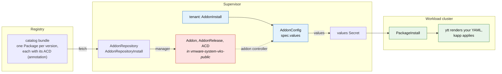

# dayzero-addon-service

[](https://github.com/warroyo/dayzero-addon-service/actions/workflows/test.yml)
[](https://github.com/warroyo/dayzero-addon-service/actions/workflows/build-release.yml)
[](https://github.com/warroyo/dayzero-addon-service/releases/latest)

A VKS addon that applies operator-supplied Kubernetes YAML into a workload cluster at
provisioning time: namespaces, service accounts, RBAC, resource quotas, and other
day-zero configuration. Tenants attach it per cluster and pass the YAML in as data, so
there is no workload-cluster kubeconfig to hand out and nothing to rebuild per payload.

## How it works

The addon ships as a Carvel package repository: a catalog carrying every released version
of the package at once. An administrator points an `AddonRepository` at it, and the VKS
addon manager creates the `Addon`, an `AddonRelease` per package version, and the
`AddonConfigDefinition`s in `vmware-system-vks-public`. Tenants then attach the addon with
an `AddonInstall` and supply YAML through an `AddonConfig` per cluster.



Whatever a tenant writes in `AddonConfig.spec.values` is rendered into a values Secret.
The guest package reads that Secret, ytt turns the values back into the original
resources, and kapp applies them. To change the payload you edit the `AddonConfig`; there
is no rebuild, version bump or re-upload.

## Install

There are two ways to install, and they end up in the same place: the same two CRs
pointing at the same published catalog. Pick whichever matches how your Supervisor is
administered. Each
[release](https://github.com/warroyo/dayzero-addon-service/releases/latest) ships the
artifact for both, already stamped with that release's catalog version and package list.

A release is a **catalog release**, not a package release. `v1.1.0` publishes
`dayzero-addon-repo:1.1.0`, which carries `dayzero.kubernetes.vmware.com` at every version
released so far. The release notes list them.

### Method 1: the Supervisor Service

For environments where services are installed through the vCenter catalog. Download
`dayzero-addon.yml` from the [latest
release](https://github.com/warroyo/dayzero-addon-service/releases/latest):

```sh
gh release download --repo warroyo/dayzero-addon-service --pattern dayzero-addon.yml
```

Then upload it through **Workload Management → Services → Add Service** and create a
service instance. The deploy places the two CRs in the service's own namespace, where the
manager reconciles them. There is nothing to edit: the catalog image and its package list
are already the package's values defaults.

Do not override `addon_package_versions` from the service config form on its own. It
generates the `package-offerings` annotation, which has to be an exact manifest of what
the catalog actually serves, and the webhook rejects a mismatch.

### Method 2: apply the AddonRepository directly

For admins with Supervisor `kubectl` access. Download `dayzero-addonrepository.yml` from
the same release and apply it:

```sh
gh release download --repo warroyo/dayzero-addon-service --pattern dayzero-addonrepository.yml
kubectl apply -f dayzero-addonrepository.yml
```

[`install/addonrepository.tpl.yml`](install/addonrepository.tpl.yml) is the ytt template it
is rendered from. To point `imageURL` at a catalog you published yourself, run
`make install-manifest ADDON_REPO=… REPO_VERSION=…` and apply `build/install/addonrepository.yml`.
Do not hand-edit the `package-offerings` annotation.

### Confirm it registered

```sh
kubectl -n vmware-system-vks-public get addon,addonrelease,acd | grep dayzero
```

You should see one `AddonRelease` and one `AddonConfigDefinition` per package version in
the catalog. Pin a cluster to one with `releaseFilter` on the `AddonInstall`.

### Moving to a new catalog release

A registered `AddonRepository` is immutable. Once an `AddonRepositoryInstall` references
it, the validating webhook allows only `spec.addonFilters` to change, which is a
helm-repository field, so an imgpkg repository like this one cannot be edited at all —
including `imageURL`. There is no way to repoint an existing registration at a new catalog.

So a new catalog release is a **new pair alongside the old one**, not an update:

1. Install the new release's `dayzero-addonrepository.yml`. It carries a distinct name and
   a distinct `spec.targetRepositoryName` (`dayzero-addon-repo-1-1-0` for catalog `1.1.0`),
   so it registers next to whatever is already there. `targetRepositoryName` names the
   backing Carvel `PackageRepository`; two catalogs sharing one would collide, so only
   mirrors of the same catalog should reuse a name.
2. Move any `releaseFilter` pins onto versions the new catalog serves.
3. Delete the superseded `AddonRepositoryInstall` and `AddonRepository`. Deletion is
   allowed — update is the blocked operation.

Within one catalog this does not apply. Every version it carries is already registered, so
moving a pin between them needs no Supervisor access and no new resources, and the older
versions stay available to roll back to.

Upgrading the Supervisor Service instance does steps 1 and 3 for you: the new service
version's CRs have new names, so the deploy creates the new pair and removes the old one
rather than attempting a rejected update.

## Usage

Each cluster needs two objects, both in the cluster's own Supervisor namespace.

First, attach the addon (once per namespace). See
[`examples/addoninstall.yml`](examples/addoninstall.yml). Then label the clusters to seed:

```sh
kubectl label cluster my-cluster addons.kubernetes.vmware.com/dayzero=enabled
```

Second, supply the payload: an `AddonConfig` named `<cluster-name>-dayzero`, carrying
the annotation `clusteraddon.addons.kubernetes.vmware.com/owned-for-deletion: "true"`.
Both the name and the annotation matter. The name is how the addon system pairs a config
with a cluster, and without the annotation the `AddonConfig` sticks around after the
`ClusterAddon` is gone.

There are two ways to supply the payload, and you can use both at once:

| Source | Field | Use when |
|---|---|---|
| Structured | `values.resources` | You are writing the payload alongside the AddonConfig and want clean diffs ([example](examples/addonconfig-structured.yml)) |
| Raw string | `values.resourcesYaml` | You are pasting in manifests you already have ([example](examples/addonconfig-inline.yml)) |

A `<cluster-name>-dayzero` ConfigMap in the same namespace gets merged in too, which helps
when a separate pipeline manages the payload
([example](examples/addonconfig-configmap.yml)).

### Security posture

The payload is applied by the addon system's own privileged identity, so treat write
access to a cluster's Supervisor namespace as equivalent to workload-cluster admin: a
tenant who can write the `AddonConfig` can apply arbitrary resources to their cluster.
That is the same authority a workload-cluster kubeconfig would grant, so it is not a new
hole, but it does mean you should not give write access to that namespace to anyone you
would not trust with the cluster itself.

An `AddonConfig` is readable by anyone with access to the Supervisor namespace. Do not
inline credentials into one.

## Scope boundary

This seeds configuration; it is not an installer. Use it for `Namespace`s,
`ServiceAccount`s, RBAC, quotas, `Secret`s and CRs. Anything that runs container images
should be its own addon or Helm chart.

## Development

```sh
make bundle              # stage the catalog for kctrl (build/bundle)
make render              # inspect one Package and the ACD it carries
make install-manifest    # render the admin-apply CRs (build/install/addonrepository.yml)
make check               # assert package-offerings matches the bundle exactly
make test                # render the ACD templates and the package ytt, validate against CRD schemas
make push                # kctrl package repository release -> the registry
make supervisor-service  # kctrl package release -> dayzero-addon.yml
make release             # check, push the catalog, build the service package
```

Both halves go through kctrl's authoring commands, on two different kinds of artifact. The
catalog is a **package repository**: `make push` runs `kctrl package repository release`
over `build/bundle`, so kbld generates the ImagesLock and imgpkg pushes it. The Supervisor
Service artifact is a **package reference** — a `Package` and its `PackageMetadata`, not a
repository — so it runs `kctrl package release` over
[`supervisor-service/`](supervisor-service/). Details in [`docs/plan.md`](docs/plan.md).

Two versions drive the build, and they are independent:

| | |
|---|---|
| `REPO_VERSION` | The catalog release. The imgpkg tag, the `AddonRepository`'s `spec.version` and `repositoryVersion`, the suffix on both object names, and the Supervisor Service package version. Set by the `v*` git tag |
| `PKG_VERSIONS` | Every package version the catalog serves. Lives in the `Makefile` and is the single source for both the bundle contents and the `package-offerings` annotation |

Released package YAML is frozen under [`released/`](released/), one file per version, and
copied into the bundle rather than re-rendered. Each `Package` carries its own
`AddonConfigDefinition` as gzip+base64 inside itself, so re-rendering an old version with
today's `addon/` templates would silently change what that version means for anyone
already pinned to it. `make bundle` only renders a version with no file there yet; commit
the result.

To ship a new package version: change `addon/`, append the version to `PKG_VERSIONS`, run
`make bundle`, commit the new file under `released/`, and tag a new `REPO_VERSION`.

`make test` renders the AddonConfigDefinition's Go templates the way the addon controller
does and the package's ytt the way the guest does, then checks that a payload encoded into
the values Secret comes back out as the original resources. It also validates the ACD
against the real CRD schema and pins the labels and namespace the validating webhook
requires. See [`docs/plan.md`](docs/plan.md).

### Releasing

Push a `v*` tag. The tag is the catalog release: `v1.1.0` sets `REPO_VERSION=1.1.0` and
publishes `ghcr.io/warroyo/dayzero-addon-repo:1.1.0`. It says nothing about package
versions — those come from `PKG_VERSIONS`, so a catalog release can add a package version,
or ship the same set from a changed `install/` template.

GitHub Actions runs `make release`, which checks the offerings against the bundle,
publishes the catalog, and builds the Supervisor Service package, then attaches both
`dayzero-addon.yml` and `dayzero-addonrepository.yml` to a GitHub release.

`supervisor-service/config/values.yml` is generated from
[`values.yml.tpl`](supervisor-service/values.yml.tpl) with the catalog version and the
package list stamped in, so the shipped service can only point at the catalog it was built
with. Edit the template, not the generated file.

## Docs

| | |
|---|---|
| [`docs/architecture.md`](docs/architecture.md) | How the VKS addon kinds fit together, with a diagram. Generic to any addon |
| [`docs/design.md`](docs/design.md) | The API constraints, why the design ended up this way, and what was rejected |
| [`docs/verify.md`](docs/verify.md) | End-to-end verification runbook |
| [`docs/plan.md`](docs/plan.md) | Repo layout and build mechanics |
| [`docs/future-direct-creation.md`](docs/future-direct-creation.md) | The package-free, fetch-free design this aimed for, why it is blocked today, and when it might work |
