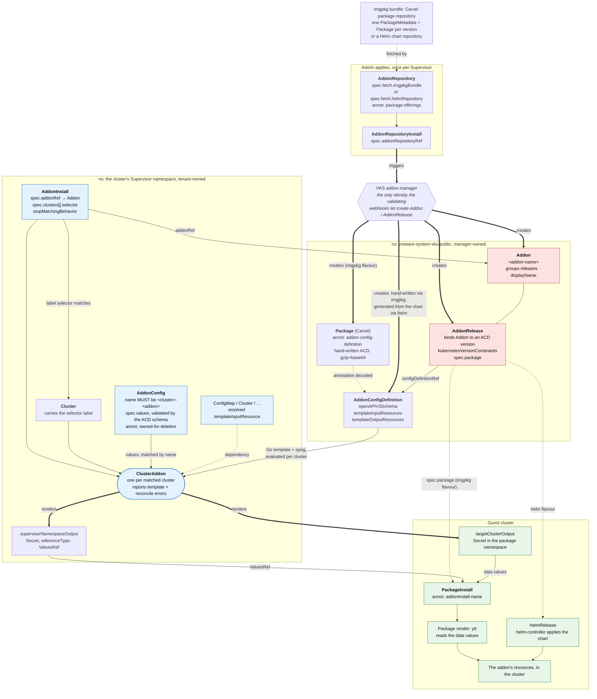

# The VKS addon resource model

How the kinds under `addons.kubernetes.vmware.com` fit together, as the system works
today on VKS 3.7. This is generic to any VKS addon, not specific to this one; for why
*this* addon is built the way it is, see [`design.md`](./design.md).

Red is manager-owned and webhook-locked. Blue is what a tenant creates. Green is inside
the workload cluster.

## The kinds

**`AddonRepository` + `AddonRepositoryInstall`**: the admin's entry point, and the only
path that produces the three manager-owned kinds. The repository names a source; the
install tells the manager to reconcile it. The repository must carry the
`addons.kubernetes.vmware.com/package-offerings` annotation, a JSON listing of the
packages and versions it offers, or the validating webhook rejects it — though the listing
is declarative: the manager materialises what the bundle contains and never checks it
against the annotation. A repository is a catalog: the builtin `vks-addons:3.7.0-20260618`
carries 22 packages, several at multiple versions, under a `repositoryVersion`
(`3.7.0+20260618`) unrelated to any of them.

Once the install references it, the repository is frozen — only `spec.addonFilters` may
change, and that is a `helmRepository` field, so an imgpkg repository cannot be edited at
all. Superseding one means registering a second pair and deleting the first. What *can*
change underneath a registration is the image the tag resolves to: the backing Carvel
`PackageRepository` holds the tag, re-resolves it on its own, and materialises whatever
package versions the new bundle carries.

**`Addon`**: one per addon, mostly metadata (`displayName`, `description`). It is the
thing an `AddonInstall` references, and it groups the releases.

**`AddonRelease`**: one per version. Binds the `Addon` to an `AddonConfigDefinition`
version and carries `kubernetesVersionConstraints`, so different guest Kubernetes versions
can resolve to different releases of the same addon.

**`AddonConfigDefinition`** (ACD): the addon's contract. `openAPIV3Schema` is the
tenant-facing values schema; `templateInputResources` declares Supervisor objects to read
(a `ConfigMap`, the `Cluster`); `templateOutputResources` declares what gets rendered per
cluster. `spec.addonInstallPermission.accessPolicies` grants the rights for those reads and
writes, in the Supervisor namespace only.

**`AddonInstall`**: the tenant attaches the addon to clusters by label selector, in the
cluster's own Supervisor namespace. `stopMatchingBehavior` decides whether the resources
are removed or left behind when a cluster stops matching.

**`AddonConfig`**: per-cluster values, validated against the ACD schema. Its name must be
`<cluster-name>-<addon-name>`; that is how the addon system pairs config to cluster. The
`clusteraddon.addons.kubernetes.vmware.com/owned-for-deletion: "true"` annotation is what
makes it garbage collected with the `ClusterAddon`.

**`ClusterAddon`**: created per matched cluster, and the thing to look at when something
is wrong. This is where the ACD's templates actually evaluate, against that cluster's
`AddonConfig`, so template errors surface in its conditions per cluster.

## Three properties worth internalising

**`Addon` and `AddonRelease` cannot be created by anyone but the manager.**
`addon.validating.vmware.com` and `addonrelease.validating.vmware.com` reject every
mutating operation from any client that is not the addon manager's service account. RBAC
does not change it; create, update, and both apply modes fail identically. The ACD is not
locked, but it is inert unless an `AddonRelease` selects it. So the `AddonRepository` is
not one option among several. It is the mechanism.

**An output template is the resource body only.** From the CRD: the template is the
resource specification *excluding* TypeMeta and ObjectMeta. No `apiVersion`, `kind` or
`metadata`, one resource per output entry, no multi-document output. `name` and
`namespace` are templatable, the GVK is a static literal on the output entry. This is why
an addon cannot emit arbitrary payload kinds from the ACD, and why anything variable gets
rendered by the package in the guest instead.

**The payload crosses into the guest as data, in a Secret.** The standard shape is a pair
of outputs with the same body: a `supervisorNamespaceOutput` Secret with
`referenceType: ValuesRef`, which the addon controller wires into the guest
`PackageInstall` as its values, and a `targetClusterOutput` Secret of the same name in the
guest package namespace (`vmware-system-tkg`). The package's own ytt reads those values and
emits the resources.

## Two repository flavours

| | `imgpkgBundle` | `helmRepository` |
|---|---|---|
| ACD | yours, shipped in the `Package` annotation as gzip+base64 | generated from the chart, fixed `helmValues`/`helmOptions` schema |
| Tenant API | whatever schema you write | helm values |
| Guest mechanism | `PackageInstall` → ytt → kapp | `HelmRelease` via helm-controller |
| `AddonRelease.spec.package` | set | not set |
| Dependencies | kapp-controller only | helm-controller must be installed |

The imgpkg flavour keeps control of the tenant-facing schema at the cost of a guest bundle
fetch, which the addon system does not offer a way around. This addon uses it; see
[`design.md`](./design.md#why-an-addonrepository).

## Template dialect

`templateOutputResources[].template` is Go `text/template` plus sprig, evaluated per
cluster by the addon controller (not CEL, despite a stale CRD field description). The
controller also registers Helm's `toYaml`/`fromYaml`. Context roots:

| Root | Is |
|---|---|
| `.Values.<field>` | the `AddonConfig` values, defaulted from the ACD schema (capital V) |
| `.Dependencies.<inputName>` | a resolved `templateInputResource`, the whole object |
| `.Cluster` | the cluster, e.g. `.Cluster.name` |
| `.Addon` | the addon |

The package's guest-side render is ytt, a different dialect entirely. Passing arbitrary
YAML between the two needs encoding, because ytt interprets `#@`; see
[`design.md`](./design.md#encoding-the-payload).

## Naming and placement

- `Addon`, `AddonRelease` and `AddonConfigDefinition` live in `vmware-system-vks-public`.
- Each must carry `addon.kubernetes.vmware.com/addon-name`; shipped addons also carry
  `addon.kubernetes.vmware.com/addon-namespace`. The webhook rejects a missing name label.
- `AddonInstall` and `AddonConfig` live in the cluster's own Supervisor namespace.
- `AddonConfig` must be named `<cluster-name>-<addon-name>`.
